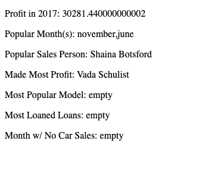

# Car Dealership

Date Created: 01/23/20 | Date Modified: 01/24/20

*This assignment is practice for Book 3: Chapter 5 of NSS's course work. Link to the assignment: https://github.com/TrinityTerry/client-side-mastery/blob/master/book-3-the-initiate/chapters/JS_ARRAY_METHODS.md#advanced-challenge-car-dealership*

Preview assignment here: https://trinity-car-dealership.netlify.com/
***

This assignment uses array methods to filter through an object to calculate/find the answers to these questions.

1. Total profit for 2017
2. In which month did they sell the most cars?
3. Which salesperson sold the most cars?
4. Which salesperson made the most profit?
5. Which model was the most popular?
6. Which bank provided the most loans to our customers?
7. In which month did zero cars get sold?

